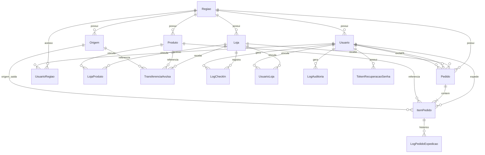

# Banco de Dados — Sistema Consignado

Este documento descreve o **modelo de dados** do sistema: tabelas, relacionamentos, índices e histórico de migrations. Complementa a [Visão Geral](01-Visao_Geral.md), as [Regras de Negócio](02-Regras-Negocios.md) e as [Telas](03-Telas.md).

> **Stack:** PostgreSQL + Prisma ORM. Schema em `prisma/schema.prisma`; migrations em `prisma/migrations/`.

---

## Índice de tabelas

| Tabela | Finalidade |
|---|---|
| `Regiao` | Filiais (Manaus, Rio Branco) |
| `Produto` | Catálogo de produtos por região |
| `Loja` | Lojas com endereço e cerca virtual |
| `LojaProduto` | Produtos ativos em cada loja |
| `Usuario` | Usuários, perfis e trava de aparelho |
| `UsuarioRegiao` | Acesso multi-região (Diretor) |
| `UsuarioLoja` | Lojas vinculadas ao promotor |
| `Pedido` | Pedido consignado (principal ou extra) |
| `ItemPedido` | Linhas quantitativas + conferência expedição |
| `Origem` | Origens de saída (fazenda, CD, etc.) |
| `TransferenciaAvulsa` | Lançamentos avulsos da expedição |
| `LogPedidoExpedicao` | Histórico de ações na expedição |
| `LogAuditoria` | Auditoria de cadastros admin |
| `LogCheckIn` | Registro legado de check-in (fluxo CLT desativado no portal) |
| `ControlePedidoLojaDia` | Controle diário principal/extra por loja |
| `TokenRecuperacaoSenha` | Tokens de redefinição de senha |

---

## Diagrama de relacionamentos

---

## 1. Regiao

Filial de operação do sistema.

| Campo | Tipo | Descrição |
|---|---|---|
| `id` | Int (PK) | Identificador |
| `nome` | String | Nome da região (ex.: Manaus, Rio Branco) |
| `createdAt` | DateTime | Data de criação |

**Relacionamentos:** 1:N com `Produto`, `Loja`, `Usuario`, `Origem`, `Pedido`, `UsuarioRegiao`.

---

## 2. Produto

Catálogo de produtos consignados por região.

| Campo | Tipo | Descrição |
|---|---|---|
| `id` | Int (PK) | Identificador |
| `codigo` | String | Código CISS |
| `descricao` | String | Nome exibido no portal |
| `precoUnitario` | Decimal(10,2) | Preço interno (não exibido ao promotor) |
| `ativo` | Boolean | Produto ativo no catálogo |
| `regiaoId` | Int (FK) | Região do produto |
| `createdAt` | DateTime | Data de criação |

**Relacionamentos:** N:1 `Regiao`; 1:N `ItemPedido`, `TransferenciaAvulsa`, `LojaProduto`.

---

## 3. Loja

Loja atendida pelo promotor, com localização e cerca virtual.

| Campo | Tipo | Descrição |
|---|---|---|
| `id` | Int (PK) | Identificador |
| `codigo` | String | Código CISS da loja |
| `nome` | String | Nome da loja |
| `ativo` | Boolean | Loja ativa |
| `cep`, `rua`, `numero`, `bairro`, `cidade` | String? | Endereço |
| `latitude`, `longitude` | Float? | Coordenadas da cerca virtual |
| `cercaVirtualAtiva` | Boolean | Cerca habilitada nesta loja |
| `perimetroCerca` | Int | Raio em metros |
| `regiaoId` | Int (FK) | Região |
| `createdAt` | DateTime | Data de criação |

**Relacionamentos:** N:1 `Regiao`; 1:N `Pedido`, `TransferenciaAvulsa`, `LogCheckIn`, `UsuarioLoja`, `LojaProduto`.

---

## 4. LojaProduto

Define quais produtos estão **ativos** em cada loja.

| Campo | Tipo | Descrição |
|---|---|---|
| `id` | Int (PK) | Identificador |
| `lojaId` | Int (FK) | Loja |
| `produtoId` | Int (FK) | Produto |
| `ativo` | Boolean | Produto ativo nesta loja |

**Constraint:** `@@unique([lojaId, produtoId])` — um vínculo por par loja/produto.

---

## 5. Usuario

Usuários do sistema (todos os perfis).

| Campo | Tipo | Descrição |
|---|---|---|
| `id` | Int (PK) | Identificador |
| `nome` | String | Nome completo |
| `usuario` | String | E-mail de login (único) |
| `senha` | String | Hash da senha |
| `funcao` | String | Perfil: Promotor, Expedição, Supervisor, ADM, Diretor |
| `genero` | String | M/F — usado em saudação |
| `telefone` | String? | Telefone opcional |
| `codCiss` | String? | Código CISS opcional |
| `clt` | Boolean | Promotor CLT (regras de cerca) |
| `cercaVirtualAtiva` | Boolean | Cerca ativa para este promotor |
| `deviceId` | String? | Aparelho vinculado (trava de login) |
| `ignorarTravaAparelho` | Boolean | Libera login em qualquer aparelho |
| `statusConta` | String | Ativo, Pendente, Inativo |
| `ativo` | Boolean | Conta ativa |
| `alterarSenhaObrigatorio` | Boolean | Força troca no próximo login |
| `regiaoId` | Int (FK) | Região principal |
| `createdAt` | DateTime | Data de criação |

**Relacionamentos:** N:1 `Regiao`; 1:N `Pedido` (criados e excluídos), `LogAuditoria`, `LogCheckIn`, `UsuarioLoja`, `UsuarioRegiao`, `LogPedidoExpedicao`, `TokenRecuperacaoSenha`, `ControlePedidoLojaDia`.

---

## 6. UsuarioRegiao

Acesso do **Diretor** (ou usuário multi-região) a mais de uma filial.

| Campo | Tipo | Descrição |
|---|---|---|
| `usuarioId` | Int (FK) | Usuário |
| `regiaoId` | Int (FK) | Região com acesso |

**Constraint:** `@@unique([usuarioId, regiaoId])`.

---

## 7. UsuarioLoja

Lojas que o **promotor** pode atender.

| Campo | Tipo | Descrição |
|---|---|---|
| `usuarioId` | Int (FK) | Promotor |
| `lojaId` | Int (FK) | Loja vinculada |

**Constraint:** `@@unique([usuarioId, lojaId])`.

---

## 8. Pedido

Pedido consignado enviado pelo promotor (principal ou extra).

| Campo | Tipo | Descrição |
|---|---|---|
| `id` | Int (PK) | Identificador interno |
| `numeroAmigavel` | Int (unique) | Número exibido (#0001, #0002…) |
| `status` | String | AGUARDANDO_APROVACAO, excluido, etc. |
| `tipoLancamento` | String | principal / extra |
| `createdAt` | DateTime | Data/hora do envio |
| `inicioVisitaEm` | DateTime? | Check-in na loja |
| `latitudeEnvio` | Float? | GPS no envio |
| `longitudeEnvio` | Float? | GPS no envio |
| `distanciaLojaMetros` | Float? | Distância até a loja no envio |
| `motivoExclusao` | String? | Motivo do cancelamento |
| `excluidoEm` | DateTime? | Data da exclusão lógica |
| `excluidoPorId` | Int? (FK) | Quem excluiu |
| `usuarioId` | Int (FK) | Promotor |
| `lojaId` | Int (FK) | Loja |
| `regiaoId` | Int (FK) | Região |

**Índices:** `numeroAmigavel`, `createdAt`, `lojaId`, `usuarioId`, `status`, compostos por região/loja/usuário + data.

**Relacionamentos:** N:1 `Usuario` (criador), `Usuario` (excluidor), `Loja`, `Regiao`; 1:N `ItemPedido`.

---

## 9. ItemPedido

Linha quantitativa de um pedido — preenchida pelo promotor e conferida pela expedição.

| Campo | Tipo | Descrição |
|---|---|---|
| `id` | Int (PK) | Identificador |
| `pedidoId` | Int (FK) | Pedido pai |
| `produtoId` | Int (FK) | Produto |
| `estoque` | Int | Estoque informado |
| `avaria` | Int | Avarias informadas |
| `trocas` | Int | Trocas solicitadas |
| `pedidoSolicitado` | Int | Quantidade pedida |
| `pedidoAtendido` | Int? | Quantidade aprovada |
| `cortePedido` | Int? | Corte aplicado |
| `estoqueConferido` | Int? | Estoque conferido |
| `corteTroca` | Int? | Corte de troca |
| `trocaAtendida` | Int? | Troca atendida |
| `bonificacao` | Int | Bonificação (default 0) |
| `origemSaida` | String? | Texto legado da origem |
| `origemId` | Int? (FK) | Origem de saída |
| `status` | String | PENDENTE, Aprovado, Reprovado |

**Índices:** `pedidoId`, `status`, `produtoId`.

**Relacionamentos:** N:1 `Pedido`, `Produto`, `Origem`; 1:N `LogPedidoExpedicao`.

---

## 10. Origem

Origem de saída dos produtos na expedição.

| Campo | Tipo | Descrição |
|---|---|---|
| `id` | Int (PK) | Identificador |
| `nome` | String | Nome da origem |
| `regiaoId` | Int (FK) | Região |
| `createdAt` | DateTime | Data de criação |

---

## 11. TransferenciaAvulsa

Lançamento manual da expedição (fora do fluxo do promotor).

| Campo | Tipo | Descrição |
|---|---|---|
| `id` | Int (PK) | Identificador |
| `quantidade` | Int | Quantidade transferida |
| `bonificacao` | Int | Bonificação |
| `motivo` | String | Motivo do lançamento |
| `data` | DateTime | Data do lançamento |
| `lojaId` | Int (FK) | Loja |
| `produtoId` | Int (FK) | Produto |
| `origemId` | Int (FK) | Origem |

---

## 12. LogPedidoExpedicao

Histórico de ações da expedição em cada item.

| Campo | Tipo | Descrição |
|---|---|---|
| `id` | Int (PK) | Identificador |
| `itemPedidoId` | Int (FK) | Item do pedido |
| `usuarioId` | Int (FK) | Usuário da expedição |
| `acao` | String | Tipo da ação |
| `detalhes` | String? | Detalhes (corte, origem, etc.) |
| `createdAt` | DateTime | Data/hora |

Usado na **Linha do Tempo** do Raio-X.

---

## 13. LogAuditoria

Registro de alterações em cadastros administrativos.

| Campo | Tipo | Descrição |
|---|---|---|
| `id` | Int (PK) | Identificador |
| `usuarioId` | Int (FK) | Quem alterou |
| `perfil` | String | Perfil no momento da ação |
| `acao` | String | Tipo (criar, editar, excluir…) |
| `registroAlterado` | String | Entidade afetada |
| `valorAnterior` | String? | Valor antes |
| `valorNovo` | String? | Valor depois |
| `createdAt` | DateTime | Data/hora |

---

## 14. LogCheckIn

Check-in do promotor ao entrar na loja.

| Campo | Tipo | Descrição |
|---|---|---|
| `id` | Int (PK) | Identificador |
| `usuarioId` | Int (FK) | Promotor |
| `lojaId` | Int (FK) | Loja |
| `latitude` | Float | GPS no check-in |
| `longitude` | Float | GPS no check-in |
| `enderecoConfirmado` | String | Endereço retornado |
| `createdAt` | DateTime | Data/hora |

---

## 15. ControlePedidoLojaDia

Controle diário por promotor/loja — impede duplicidade de pedido principal e controla extra.

| Campo | Tipo | Descrição |
|---|---|---|
| `id` | Int (PK) | Identificador |
| `usuarioEmail` | String | E-mail do promotor |
| `usuarioId` | Int? (FK) | ID do promotor |
| `lojaId` | String | ID da loja (texto) |
| `dataReferencia` | String | Data ISO (YYYY-MM-DD) |
| `pedidoPrincipalEnviado` | Boolean | Principal já enviado hoje |
| `pedidoExtraRealizado` | Boolean | Extra já realizado |
| `createdAt`, `updatedAt` | DateTime | Controle de versão |

**Constraint:** `@@unique([usuarioEmail, lojaId, dataReferencia])`.

---

## 16. TokenRecuperacaoSenha

Tokens para fluxo de recuperação de senha por e-mail.

| Campo | Tipo | Descrição |
|---|---|---|
| `id` | Int (PK) | Identificador |
| `token` | String (unique) | Token do link |
| `usuarioId` | Int (FK) | Usuário |
| `expiresAt` | DateTime | Expiração |
| `usedAt` | DateTime? | Quando foi usado |
| `createdAt` | DateTime | Criação |

**Índices:** `usuarioId`, `expiresAt`.

---

## Histórico de migrations

| Migration | Data (nome) | O que alterou |
|---|---|---|
| `20260619190142_inicializacao_banco` | Jun/2026 | Schema inicial: Regiao, Produto, Loja, Usuario, Pedido, ItemPedido, Origem, TransferenciaAvulsa, logs |
| `20260630120000_cerca_virtual` | Jun/2026 | `cercaVirtualAtiva` e `perimetroCerca` em Loja; `cercaVirtualAtiva` em Usuario |
| `20260701120000_loja_numero` | Jul/2026 | Campo `numero` no endereço da loja |
| `20260702130000_pedido_auditoria_gps` | Jul/2026 | `latitudeEnvio`, `longitudeEnvio`, `distanciaLojaMetros` em Pedido |
| `20260702140000_pedido_inicio_visita` | Jul/2026 | `inicioVisitaEm` em Pedido (check-in) |
| `20260703220000_pedido_numero_amigavel_soft_delete` | Jul/2026 | `numeroAmigavel`, exclusão lógica (`motivoExclusao`, `excluidoEm`, `excluidoPorId`) |
| `20260705220000_device_id_paginacao_indexes` | Jul/2026 | `deviceId` em Usuario; índices de paginação |
| `20260706160000_token_recuperacao_senha` | Jul/2026 | Tabela `TokenRecuperacaoSenha` |
| `20260706170000_usuario_email_unique` | Jul/2026 | Unicidade do e-mail (`usuario`) |

---

## Comandos úteis

| Comando | Função |
|---|---|
| `npx prisma migrate dev` | Aplica migrations em desenvolvimento |
| `npx prisma generate` | Gera client Prisma (`app/generated/prisma`) |
| `npx prisma db push` | Sincroniza schema sem migration (dev rápido) |
| `npm run seed:usuarios` | Seed de usuários de teste |
| `npm run regeocodificar:lojas` | Regeocodifica coordenadas das lojas |

---

## Próximo documento

→ [05-Prompt-Mestre.md](05-Prompt-Mestre.md) — prompt consolidado para IA
